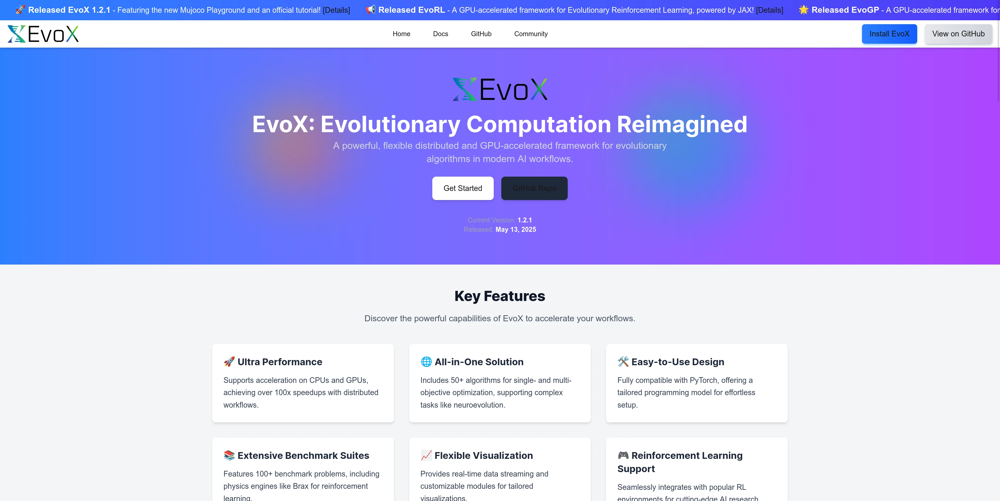
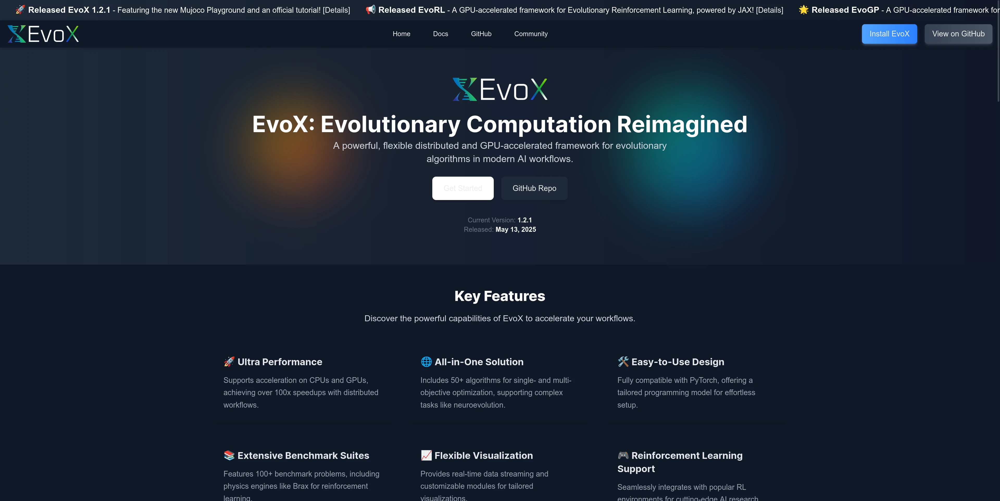
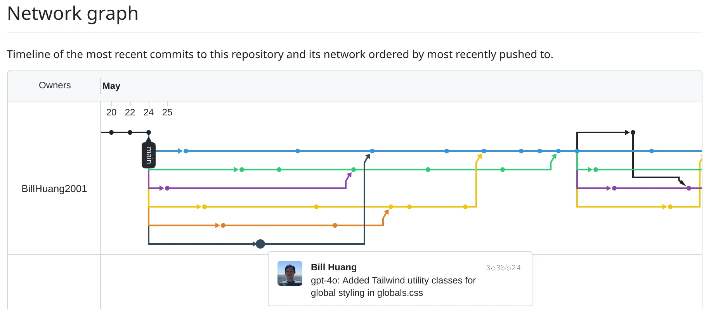

<h1 align="center">
  <picture>
    <source media="(prefers-color-scheme: dark)" srcset="static/evogit_logo_with_light_text.svg">
    <source media="(prefers-color-scheme: light)" srcset="static/evogit_logo_with_dark_text.svg">
    
  </picture>
</h1>

<h2 align="center"><strong><em>Decentralized Code Evolution via Git-Based Multi-Agent Collaboration</em></strong></h2>

<p align="center">
  <a href="https://www.arxiv.org/abs/2506.02049">
    
  </a>
  <a href="https://github.com/BillHuang2001/evogit">
    
  </a>
  <a href="https://discord.gg/Vbtgcpy7G4">
    
  </a>
  <a href="https://qm.qq.com/q/vTPvoMUGAw">
    
  </a>
</p>

---

<details open>
  <summary><strong>🎬 EvoGit Animation (click to hide)</strong></summary>

  <picture>
    <source media="(prefers-color-scheme: dark)" srcset="static/animated_evogit_light_text.avif">
    <source media="(prefers-color-scheme: light)" srcset="static/animated_evogit_dark_text.avif">
    
  </picture>

</details>

---


## 👋 Table of Contents

1. [🚀 Overview](#🚀-overview)
2. [✨ Key Features](#✨-key-features)
3. [📦 Live Demos](#📦-live-demos)
4. [🧬 How to Explore the Results](#🧬-how-to-explore-the-results)
5. [📚 Paper](#📚-paper)


## 🚀 Overview

**EvoGit** is a decentralized, Git-native framework for autonomous software development. It leverages a population of LLM-based agents that evolve code collaboratively—without centralized control—mirroring principles of natural selection and mutation.

Each agent independently proposes, mutates, and merges code changes, forming a fully traceable version graph managed by Git.

For detailed methodology and experimental results, refer to our [paper](https://arxiv.org/abs/2506.02049).


## ✨ Key Features

* 🧠 **Fully Autonomous Multi-Agent Development**: A population of coding agents collaboratively develops software, with humans acting only as high-level product managers.
* 🔁 **Minimal Human Intervention**: Once initialized, the system evolves independently, requiring only occasional strategic input or feedback from humans.
* ⚙️ **Git-Native Code Evolution**: All changes are tracked through Git commits and branches, using Git as both the execution backbone and the interface between human and agents.
* 🌿 **Transparent Evolutionary Lineage**: Every commit, branch, merge, and timestamp is fully version-controlled, enabling complete traceability and auditability of the development process.


## 📦 Live Demos

Explore how **EvoGit** enables collaborative AI development across two real-world projects.
For more details, please visit the respective GitHub repositories and inspect the Git history to see how multiple agents evolved the code.

### [📃 Web Applicaiton Development](https://github.com/BillHuang2001/evogit_web) -- [link](https://github.com/BillHuang2001/evogit_web)

> A multi-agent AI system collaboratively builds a complete one-page interactive website—from layout and UI to animations and dark mode.
> The project was initialized by a human product manager and guided with ~10 feedback interventions.

<details>
  <summary><strong>🔍 Result (click to expand)</strong></summary>

The final web page demonstrates a polished UI with support for both light and dark themes.




</details>

---

### [🧠 Meta-Level Code Synthesis](https://github.com/BillHuang2001/evogit_llm) -- [link](https://github.com/BillHuang2001/evogit_web)

> AI agents iteratively evolve a **meta-level algorithm designer**, which itself generates and refines a solver for the classic **Bin Packing Problem**.
> This creates a two-layer pipeline:
> **EvoGit → Auto Algorithm Designer → Bin Packing Solver**
> A human manager provided an initial setup and ~5 rounds of feedback throughout the optimization process.

<details>
  <summary><strong>🔍 Result (click to expand)</strong></summary>

The AI-generated automatic algorithm design program efficiently found a solver that minimizes bin usage, as shown in the final output script:

```python
def bin_packing_solver(items: list[float], budget: int) -> list[int]:
    import time

    if not items or not all(0 <= w <= 1 for w in items):
        return []

    start_time = time.time()

    items_sorted = sorted(enumerate(items), key=lambda x: x[1], reverse=True)
    bins = []
    bin_indices = [-1] * len(items)

    for index, weight in items_sorted:
        placed = False
        for bin_index, bin_weight in enumerate(bins):
            if bin_weight + weight <= 1:
                bins[bin_index] += weight
                bin_indices[index] = bin_index
                placed = True
                break
        if not placed:
            bins.append(weight)
            bin_indices[index] = len(bins) - 1

    best_solution = bin_indices[:]
    best_bin_count = len(bins)

    def refine_solution():
        nonlocal best_solution, best_bin_count
        for _ in range(100):  # attempt refinement a number of times
            new_bins = []
            new_bin_indices = [-1] * len(items)
            new_solution = []
            for i in range(len(items)):
                weight = items[i]
                placed = False
                for bi in range(len(new_bins)):
                    if new_bins[bi] + weight <= 1:
                        new_bins[bi] += weight
                        new_bin_indices[i] = bi
                        placed = True
                        break
                if not placed:
                    new_bins.append(weight)
                    new_bin_indices[i] = len(new_bins) - 1
            new_bin_count = len(new_bins)

            if new_bin_count < best_bin_count:
                best_solution = new_bin_indices
                best_bin_count = new_bin_count

            if (time.time() - start_time) * 1000 > budget:
                break

    refine_solution()

    return best_solution
```

The optimized code is automatically saved as `best_solution.py` after the search process completes.
</details>


## 🧬 How to Explore the Results

EvoGit uses Git not only as a version control tool, but also as a transparent window into the code evolution process. Here's how to inspect our demos:

1. 🧑‍💻 The human-initialized seed lives in the `main` branch.
2. 🤖 AI-generated code lives in branches named:
   `host<i>-individual-<j>`,
   where `i` = host node index, `j` = agent index.
3. 🔍 Each agent branch contains an independent development trajectory. You can explore these using GitHub’s commit history or local Git tools.
4. 📈 Git diffs and logs reveal the precise changes made in each commit.
5. 🧭 Use `git log --graph` or GitHub’s branch visualization (under Insights -> Network) to see how code diverged and converged over time.

<details>
  <summary><strong>🔍 Example Git Graph (click to expand)</strong></summary>

  
</details>

All changes are versioned and traceable. Every commit represents an autonomous decision by an agent—captured, auditable, and reproducible through Git.

> [!NOTE]
> GitHub may hide some branches. Click **“View all branches”** on the repo page to see the complete version graph.


## 📚 Paper

Read the full framework design, evaluation methodology, and results in our paper:
- **[ArXiv:2506.02049](https://arxiv.org/abs/2506.02049)**
